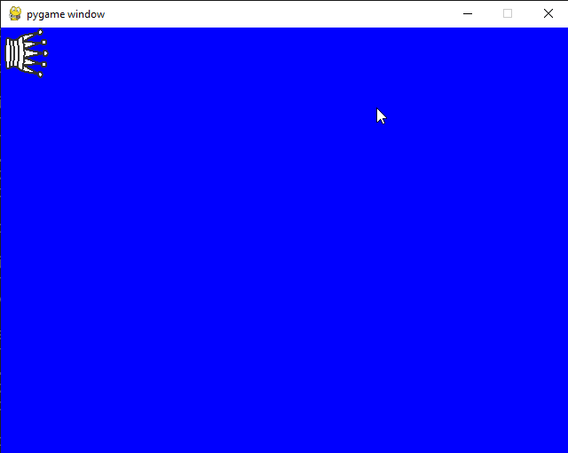
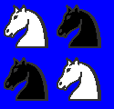
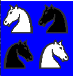
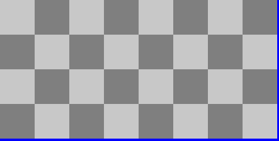
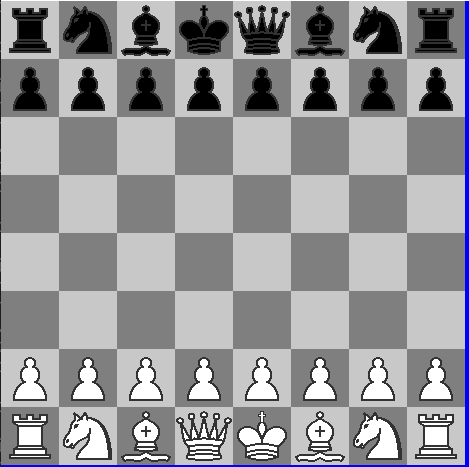
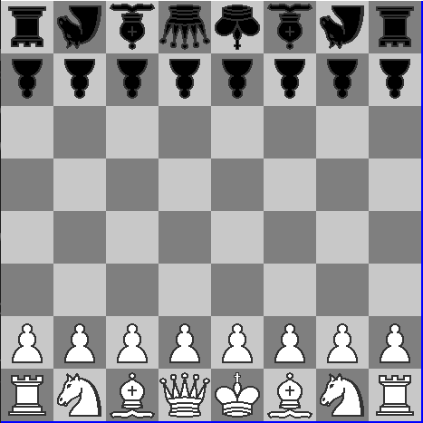

# Programación Web 2 - Python Classes
**Estudiante:** Gustavo Eduardo Ordoño Poma

**Ejercicios Resueltos:**
```python
* Ejercicio 1 [✔]
* Ejercicio 2 [✔]
```

**Ejercicios Propuestos:**
* **Ejercicio 1: Implementación de los métodos de la clase Picture**
```python
verticalMirror() [✔]
horizontalMirror() [✔]
negative() [✔]
join() [✔]
up() [✔]
under() [✔]
horizontalRepeat() [✔]
verticalRepeat() [✔]
```
* rotate():



* **Ejercicios 2: Usando únicamente los métodos de los objetos de la clase Picture dibuje las siguientes figuras (invoque a draw)**:

* Ejercicio2a:



* Ejercicio2b:



* Ejercicio2c:


* Ejercicio2d:


* Ejercicio2e:


* Ejercicio2f:



* Ejercicio2g:



* Aditivo:

